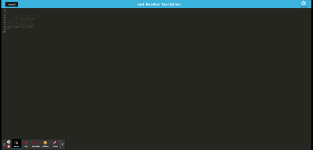

  
# Werd-to-the-Words

## Description
This project this is a simple text editor that will save text input even when you're offline by Open the heroku link below in your browser!  You may install this app as well!.  My motivation for this project was to create an application that runs offline and stores data even when internet connection is disrupted or disconnected.
I wanted to solve the problem of This application helps save your text when internet connection is unstable or goes offline.  I learned I learned how the Progressive Mobile Application architecture works for a text editor.  I learned how to implement the idb node package to store data within the browser for offline functionality.  I also used the node package concurrently to have two different package.json files.  I used different code for client side versus server side.  I learned how to use webpack and the service worker to allow for node packages to run within the front-end and allow install features.. 

# Table of Contents
- [Installation](#Installation)
- [Description](#Description)
- [Usage](#Usage)
- [What-I-learned](#What-I-Learned)
- [Tests](#Tests)
- [Screenshot-of-Application](#Screenshot-of-Application)
- [Links](#Links)
- [Questions?](#Questions?)
- [License](#License)

## Installation
In order to install this project you will need to If you are interested in running this applicaiton from outside Heroku, then you would need to clone the repository, `npm i` and `npm run start:dev` in order to install the service worker and create the dist folder for front-end functionality.

## Usage
This Project is used for this is a simple text editor that will save text input even when you're offline. *elaborate on your project motivation and use here*

## What-I-Learned
This Project works by Open the heroku link below in your browser!  You may install this app as well!, and I learned I learned how the Progressive Mobile Application architecture works for a text editor.  I learned how to implement the idb node package to store data within the browser for offline functionality.  I also used the node package concurrently to have two different package.json files.  I used different code for client side versus server side.  I learned how to use webpack and the service worker to allow for node packages to run within the front-end and allow install features..  
The email me! were issues in this project.
*Elaborate what you learned and add coding comments here*

  *insert code snippets here*

##Tests
Test this code by none

## Screenshot of Application

## Links
[Heroku Deployment](https://werd-to-the-words.herokuapp.com/)

[GitHub Repo](https://github.com/Byrdbass/Werd-to-the-Words) 

## Questions?
My gitHub user name is byrdbass, and you may email me at byrdbass@gmail.com for Questions.
You may contribute to this project by none.

## License
MIT
